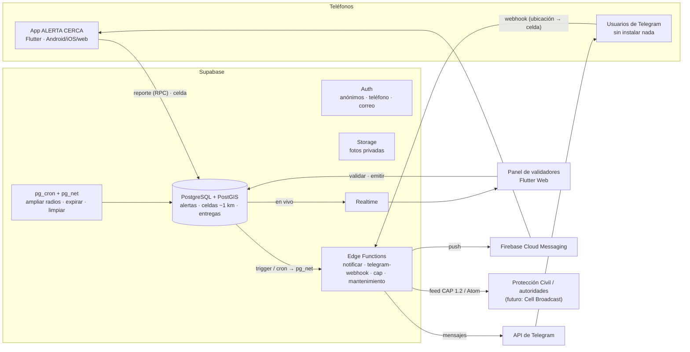
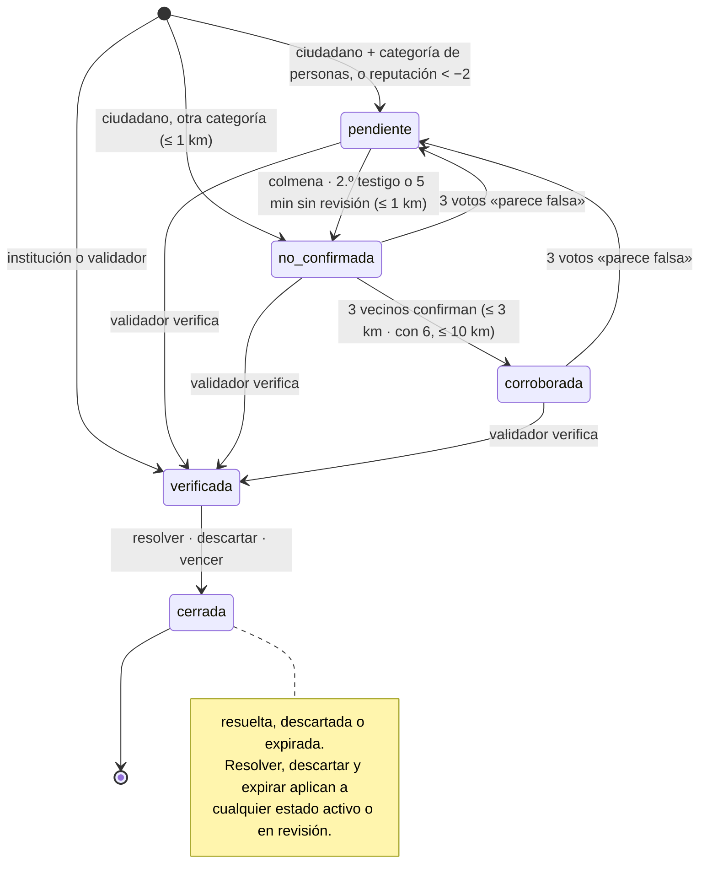
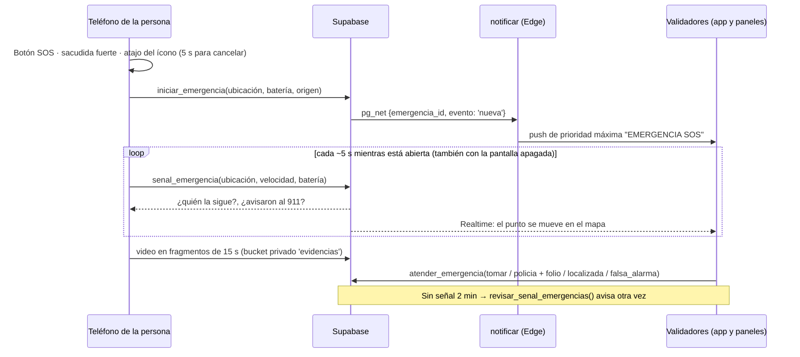

# Arquitectura

## Flujo mínimo del reto (sección 12) en el código

| # | Paso del reto | Dónde ocurre |
|---|---|---|
| 1 | Ocurre un acontecimiento | — |
| 2 | Se genera una alerta | `crear_reporte()` en [004_funciones.sql](../supabase/migrations/004_funciones.sql) · pantalla *Reportar* (app) · *Emitir alerta oficial* (panel) |
| 3 | Se geolocaliza | `alertas.lat/lon` → trigger `fijar_ubicacion_alerta` ([002_triggers.sql](../supabase/migrations/002_triggers.sql)) |
| 4 | Nivel de importancia y radio | tabla `categorias` + `escalones_radio` ([seed.sql](../supabase/seed.sql)) · `radio_permitido()` con tope por confianza |
| 5 | Se identifican los usuarios cercanos | `dispositivos_objetivo()`: celdas a menos de radio + 700 m (y *mis zonas*) que aún no la recibieron |
| 6 | Se distribuye | Edge Function [`notificar`](../supabase/functions/notificar/index.ts): aparta en `entregas` y envía FCM y Telegram |
| 7 | La comunidad recibe la alerta | `procesarAlerta()` en [notificaciones.dart](../app/lib/nucleo/notificaciones.dart): distancia exacta calculada en el teléfono |

## Estados de una alerta

## Colmena: la comunidad no depende de un administrador

Los validadores aceleran y corrigen, pero no son un cuello de botella
([007_colmena.sql](../supabase/migrations/007_colmena.sql)):

| Regla | Efecto |
|---|---|
| Un reporte en revisión que nunca se publicó y **nadie revisa en 5 min** | `publicar_pendientes()` (pg_cron, cada 15 s) lo publica como NO CONFIRMADO (≤ 1 km). No aplica a autores con reputación < −2 ni a lo que regresó a revisión por votos |
| **Otra persona verificada reporta lo mismo** (misma categoría, < 500 m, < 30 min) | Cuenta como segundo testigo: se publica al instante |
| **3 “lo confirmo”** | CORROBORADA: tope de 3 km |
| **6 o más “lo confirmo”** | Alcance de colmena: tope de 10 km |
| **3 “parece falsa”** | Regresa a revisión; ya no sale sola |
| Foto de una **persona** (menor, desaparecida, vulnerable) | Solo se muestra cuando la alerta está corroborada o verificada: la colmena difunde el aviso, la foto llega con la confianza |
| **Teléfono verificado** | Necesario para reportar, confirmar y subir fotos (una cuenta de correo sola no basta) |

Los umbrales viven en la tabla `config` (`minutos_espera_validador`, `confirmaciones_corroborar`,
`confirmaciones_colmena`, `radio_max_corroborada_m`, `radio_max_colmena_m` y `reportes_por_hora`): se ajustan sin
programar.

Quien reporta no puede confirmar su propio reporte: en su detalle la app le muestra cuántas confirmaciones de vecinos
lleva y cuántas faltan para el siguiente radio.

## Modo emergencia (SOS): para la persona a la que le está pasando

Lo demás de ALERTA CERCA mira hacia afuera (un incendio, un menor perdido). El SOS es para quien está en peligro:
asalto, secuestro, alguien la sigue ([011_emergencias.sql](../supabase/migrations/011_emergencias.sql)).

| Pieza | Qué hace |
|---|---|
| Disparo | Botón rojo **SOS** del inicio; **sacudida fuerte** (4 golpes ≥ 2.5 g en 1 s: caminar o correr no la disparan) con la app abierta; **modo protección** (servicio de Android con notificación fija) con la app cerrada o el teléfono bloqueado, que muestra la cuenta encima de la pantalla de bloqueo; **atajo** al mantener presionado el ícono. Siempre 5 s para cancelar; hay **simulacro** para practicar |
| Cancelar protegido | Para que un ladrón no apague el SOS en un forcejeo, cancelar la cuenta regresiva o terminar la emergencia pide **huella o PIN** del teléfono (`local_auth`). La cuenta NO se pausa mientras se autentica: si el ladrón no pasa el PIN, el SOS se dispara igual. Si el teléfono no tiene bloqueo, no se exige (y la app sugiere ponerlo). Opción en *Ajustes → Modo emergencia*, activada por defecto |
| Quién recibe | Solo validadores, instituciones y admin (`dispositivos_validadores()`), nunca los vecinos: avisarle a todos podría exponer a la persona. Si conviene que la colmena ayude a buscar, el validador emite una alerta normal |
| Seguimiento | Recorrido en vivo, velocidad (> 20 km/h = probablemente en un vehículo), batería, precisión, teléfono verificado (si lo hay), línea de tiempo y video. Acciones: tomar el caso, registrar el aviso al 911 con folio, notas, cerrar como localizada o falsa alarma |
| La persona ve | "Tu alerta llegó" → "Protección Civil ya te está siguiendo" → "La policía ya fue avisada"; botón **Llamar al 911**, "¿Qué está pasando?" (me asaltan / me llevan / me siguen), compartir su ubicación con alguien de confianza y **Estoy a salvo** |
| Evidencia (video) | Video con audio mientras la pantalla del SOS está abierta, en fragmentos de 15 s (~2 MB) que se suben en cuanto terminan: si le quitan el teléfono, lo grabado ya está a salvo. Android siempre muestra el indicador de cámara |
| Evidencia (audio en vivo) | Cuando la cámara no está grabando (pantalla apagada, teléfono en la bolsa), el **micrófono** graba segmentos de ~6 s que se suben al terminar cada uno: el validador oye lo que pasa con unos segundos de retraso. Sigue en segundo plano con un servicio de micrófono (Android 14+). Cámara y micrófono nunca graban a la vez (no se pelean el micrófono); sin conexión, los fragmentos se reintentan |
| Robustez | Sin internet, el SOS se reintenta cada 5 s (mientras tanto, el 911); una emergencia abierta se retoma si la app se cierra; "Estoy a salvo" sin conexión se manda al volver. Una abierta por persona; máx. `emergencias_por_hora` (5) |
| Sin señal | Si el teléfono deja de mandar señal `minutos_sin_senal` (2), `revisar_senal_emergencias()` (pg_cron, 30 s) avisa una vez a los validadores. Nunca se cierra sola |
| Llamar al 911 | Abre el marcador con el 911: Android no deja que una app llame sola a emergencias, y una llamada automática por una falsa activación mandaría patrullas por nada. El validador también avisa al 911 con la ubicación en vivo |

Ajustes en `config`: `emergencias_por_hora`, `minutos_sin_senal`, `dias_retencion_emergencia`.

## Privacidad: qué se guarda y qué no

| Dato | ¿En el servidor? | Detalle |
|---|---|---|
| Ubicación exacta del teléfono | **No** | Solo en el teléfono (para calcular la distancia exacta) |
| Celda de ~1 km del teléfono | Sí | Se sobrescribe al moverse: no hay historial |
| Historial de recorridos | **No** | No existe en ninguna tabla (salvo durante un SOS, abajo) |
| Ubicación exacta y recorrido **durante un SOS** | Sí, mientras está abierto | Única excepción: la persona misma pidió ayuda. Solo la ven ella y los validadores; se borra a los 30 días del cierre |
| Video y audio de evidencia del SOS | Sí, bucket privado | Solo la persona y los validadores (enlaces firmados de 10 min); se borra a los 30 días del cierre |
| Zonas (casa, escuela) | Solo su celda | El punto exacto se queda en el teléfono |
| Ubicación del suceso | Sí, exacta | Es un lugar, no una persona |
| A quién se envió cada alerta | Sí, 30 días | Para no repetir envíos; se borra sola |
| Teléfono de quien reporta | Sí (Auth) | Nunca se muestra a otros usuarios |
| Quién confirmó qué | Sí | Solo lo ven la propia persona y los validadores |
| Metadatos de fotos | **No** | La app los elimina antes de subir |

## Por qué estas tecnologías

- **PostgreSQL + PostGIS (Supabase)**: “¿quién está a menos de X metros?” es una consulta SQL con índice espacial
  (≈2–3 ms con 5,000 teléfonos). Auth, Storage, Realtime y Edge Functions en el mismo plan gratuito.
- **Firebase Cloud Messaging**: push gratis e independiente del operador; solo se usa para entregar notificaciones.
- **Flutter**: un solo código para Android, iOS y la web del panel; el paquete [`compartido`](../compartido) evita
  duplicar modelos y reglas.
- **OpenStreetMap**: mapas sin llave ni costo (respetando su política de uso).
- **Telegram y CAP 1.2**: canal alterno sin instalar nada y formato estándar para integrarse con autoridades.

Las decisiones que mejoran la propuesta original están en el [README](../README.md#mejoras-sobre-la-propuesta-detectadas-al-implementarla-y-cubiertas-por-pruebas).
